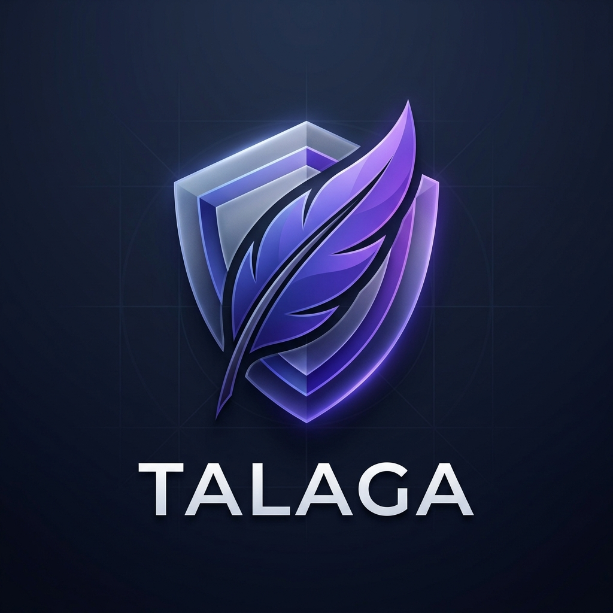

# 💎 Talaga - Digital Sanctuary

Welcome to **Talaga**, a premium, full-stack note-taking sanctuary designed for clear thinking, professional organization, and state-of-the-art security.



## 🚀 Key Features
- **Elite Design**: Modern glassmorphism UI with smooth animations and dark mode.
- **Reliability Core v3.4**: Advanced Firebase authentication with local session persistence.
- **Full-Stack Power**: Node.js backend with PostgreSQL storage and JWT security.
- **Mobile First**: 100% responsive navigation and interactive features.
- **Integrated Help**: In-app interactive tutorial and keyboard shortcuts.

## 🛠️ Tech Stack
- **Frontend**: Vanilla JS, HTML5, CSS3 (Glassmorphism), Firebase Auth
- **Backend**: Node.js, Express, Firebase Admin SDK
- **Database**: PostgreSQL (Managed by Aiven)
- **Deployment**: GitHub Pages (Frontend) & Render (Backend)

## 📦 How to Update
Updating your sanctuary is automated for your convenience:

1.  Open your terminal in the project root.
2.  Run the sync tool:
    ```powershell
    .\sync.ps1
    ```
3.  Enter your update message, and the system handles the rest!

## 📂 Repository Structure
- `/backend`: The power behind the sanctuary (Server, API, Database logic).
- `/images`: Brand assets and logos.
- `/root`: Premium frontend assets (index.html, app.js, styles.css).

---
*Created with excellence for **Jemmy Francisco**.*
